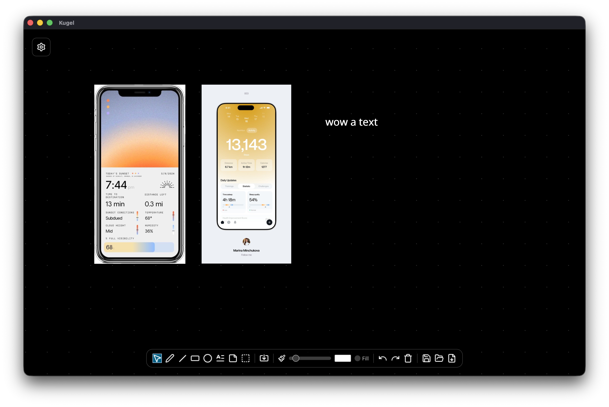

# Kugel

A minimalist, high performance mood board, which runs on desktop.

## Features

- Infinite Canvas with zoom and pan support, bg color and compact bottom toolbar to draw minimal vector shapes and if not too hard, text
- Ability to read any kind of image format, either by dropping, copy pasting or import dialog
- Automatic scaling down and compressing all input images to a max short side resolution of 2000px
- Images should be able to be transformed on canvas (resized with keeping original aspect, translated on canvas, duplicated)
- Save and openable, portable file format that embeds all images and canvas properties
- Highly modular architecture with high test coverage
- Insanely performant
- Good set of keyboard shortcuts which resembles other graphic applications worksflows
- FULL Canvas export to png at least with variable export quality settings